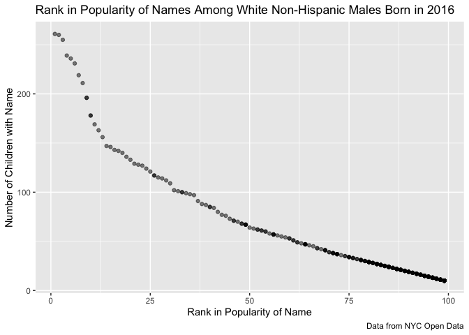

p8105\_hw2\_mm5351
================
Martha Mulugeta
9/28/2019

***Problem 1***

``` r
##Read and clean Mr. Trash Wheel data
trash_data =
   readxl::read_excel("./Data/Trash-Wheel-Collection-Totals-8-6-19.xlsx", sheet = "Mr. Trash Wheel", range = "A2:N408") %>%    
janitor::clean_names() %>%    

##Omit rows that do not include dumpster-specific data
drop_na(dumpster) %>% 

##Round the number of sports balls to the nearest integer and convert to integer variable
mutate( 
  sports_balls = as.integer(round(sports_balls, digits = 0))) 
```

``` r
##Read and clean 2017 precipiation data
precip2017_data = 
  readxl::read_excel("./Data/Trash-Wheel-Collection-Totals-8-6-19.xlsx", sheet = "2017 Precipitation", range = "A2:B14") %>% 
  janitor::clean_names() %>% 

##Omit rows without precipiation data and add variable year
drop_na() %>% 
mutate(
  year = 2017)  

##Read and clean 2018 precipiation data
precip2018_data =
  readxl::read_excel("./Data/Trash-Wheel-Collection-Totals-8-6-19.xlsx", sheet = "2018 Precipitation", range = "A2:B14") %>% 
  janitor::clean_names() %>% 
  
##Omit rows without precipiation data and add variable year
drop_na() %>% 
mutate(
  year = 2018)  

##Combine datasets
precipfull_data = 
  left_join(precip2017_data, precip2018_data, by = "month") %>% 

##Convert month to character variable
mutate(
  month = as.character(month.name))
```

In the Mr. Trash Wheel dataset, there are 344 rows and 14 columns. Each
row represents data for a different dumpster, and many of the columns
depict the type of trash found in the Inner Harbor of Baltimore. The
median number of sports balls in a dumpster in 2017 was 8. The total
number of trash collected between 2014 and 2018 was 1122.45 tons, which
was incinerated and made to power 1.507583310^{4} homes. In the combined
precipiation dataset for 2017 and 2018, there are 12 rows representing
each month of the year and 5 columns for month, year 2017, total
precipation for year 2017, year 2018, and total precipiation for year
2018. The total precipiation for 2017 was 32.93 inches. This compares to
the total precipiation for 2018, which was 70.33 inches.

***Problem 2***

``` r
##Read and clean pols-month.csv data
polsmonth_data = 
  read_csv("./Data/fivethirtyeight_datasets/pols-month.csv") %>% 
  janitor::clean_names() %>% 
  
##Separate "mon" into integer variables year, month and day. Replace month number with month name
separate(col = mon, sep = "-", into = c("year", "month", "day")) %>%  
mutate(
  year = as.integer(year),
  month = as.integer(month),
  day = as.integer(day),
  month = month.name[month],

##Create a president variable taking values gop and dem
  president = 
    case_when(prez_dem == 1 ~ "dem", prez_gop == 1 ~ "gop")) %>% 

##Remove prez_dem, prez_gop, and the day variable
select(everything(), -prez_dem, -prez_gop, -day)
```

    ## Parsed with column specification:
    ## cols(
    ##   mon = col_date(format = ""),
    ##   prez_gop = col_double(),
    ##   gov_gop = col_double(),
    ##   sen_gop = col_double(),
    ##   rep_gop = col_double(),
    ##   prez_dem = col_double(),
    ##   gov_dem = col_double(),
    ##   sen_dem = col_double(),
    ##   rep_dem = col_double()
    ## )

``` r
##Read and clean data in snp.csv
snp_data = 
  read_csv("./Data/fivethirtyeight_datasets/snp.csv") %>% 
  janitor::clean_names() %>% 

##Arrange according to year and month; year and month as leading columns
separate(col = date, sep = "/", into = c("month", "day", "year")) %>% 
mutate(
  month = as.integer(month),
  day = as.integer(day),
  year = as.integer(year),
  month = month.name[month]
) %>% 
select(year, month, close) 
```

    ## Parsed with column specification:
    ## cols(
    ##   date = col_character(),
    ##   close = col_double()
    ## )

``` r
##Tidy unemployment data
unemployment_data = 
  read_csv("./Data/fivethirtyeight_datasets/unemployment.csv") %>% 
  janitor::clean_names() %>%
  na.omit() %>% 
  pivot_longer(
    jan:dec,
    names_to = "month",
    values_to = "unemployment"
  ) %>% 
    mutate(
      month = recode(month, 
        "jan" = "January", 
        "feb" = "February",
        "mar" = "March",
        "apr" = "April",
        "may" = "May",
        "jun" = "June",
        "jul" = "July",
        "aug" = "August",
        "sep" = "September",
        "oct" = "October",
        "nov" = "November",
        "dec" = "December"))
```

    ## Parsed with column specification:
    ## cols(
    ##   Year = col_double(),
    ##   Jan = col_double(),
    ##   Feb = col_double(),
    ##   Mar = col_double(),
    ##   Apr = col_double(),
    ##   May = col_double(),
    ##   Jun = col_double(),
    ##   Jul = col_double(),
    ##   Aug = col_double(),
    ##   Sep = col_double(),
    ##   Oct = col_double(),
    ##   Nov = col_double(),
    ##   Dec = col_double()
    ## )

``` r
##Join snp and pols
economyfull_data = 
  left_join(polsmonth_data, snp_data, by = c("year", "month")) %>% 
  
##Merge unemployment into result  
  left_join(unemployment_data, by = c("year", "month"))
```

The snp\_data dataset contained monthly data from 1950 to 2015 regarding
the S\&P stock index closing values. There are 787 rows and 3 columns.
The polsmonth\_data dataset contained monthly data from 1947 to 2015
regarding the number of politicians (governors, senators,
representatives, and the president) broken down by party (democratic or
republican). There are 822 rows and 9 columns. The unemployment\_data
dataset contained monthly data from 1948 to 2015 regarding the
corresponding unemployment percentage. There are 804 rows and 3 columns.
The resulting combined dataset, economyfull\_data, contains 822 rows and
11 columns, with data from 1947 to 2015. As a result, there are some
missing S\&P close values and unemployment percentages since those
datasets began collecting data after 1947.

***Problem 3***

``` r
##Read and clean popular baby names csv
babynames_data = 
  read_csv("./Data/Popular_Baby_Names.csv") %>% 
  janitor::clean_names() %>%
  mutate(
    childs_first_name = str_to_upper(childs_first_name),
    ethnicity = recode(ethnicity, "ASIAN AND PACI" = "ASIAN AND PACIFIC ISLANDER"),
    ethnicity = recode(ethnicity, "BLACK NON HISP" = "BLACK NON HISPANIC"),
    ethnicity = recode(ethnicity, "WHITE NON HISP" = "WHITE NON HISPANIC")
  ) %>% 

##Remove duplicated rows
distinct()  
```

    ## Parsed with column specification:
    ## cols(
    ##   `Year of Birth` = col_double(),
    ##   Gender = col_character(),
    ##   Ethnicity = col_character(),
    ##   `Child's First Name` = col_character(),
    ##   Count = col_double(),
    ##   Rank = col_double()
    ## )

``` r
##Make table showing rank in popularity of name Olivia over time
Olivia_rank = babynames_data %>% 
  select(everything(), -count) %>% 
  filter(gender == "FEMALE", childs_first_name == "OLIVIA") %>%  
pivot_wider(
  names_from = year_of_birth,
  values_from = rank,
) %>% 
  select(everything(), -childs_first_name, -gender) 
```

``` r
##Make table showing most popular name among male children over time
Male_rank = babynames_data %>% 
select(everything(), -count) %>% 
filter(gender == "MALE", rank == 1) %>% 
pivot_wider(
  names_from = year_of_birth,
  values_from = childs_first_name,
) %>% 
  select(everything(), -gender, -rank)
```

``` r
##Make scatterplot for male, white non-hispanic children born in 2016 with number of children with a name (y axis) against rank of that name (x axis)
filter(babynames_data, gender == "MALE", ethnicity == "WHITE NON HISPANIC", year_of_birth == "2016") %>% 
  ggplot(aes(x = rank, y = count)) +
  geom_point(alpha = 0.5) +
    labs(
    title = "Rank in Popularity of Names Among White Non-Hispanic Males Born in 2016",
    x = "Rank in Popularity of Name",
    y = "Number of Children with Name",
    caption = "Data from NYC Open Data")
```

<!-- -->
